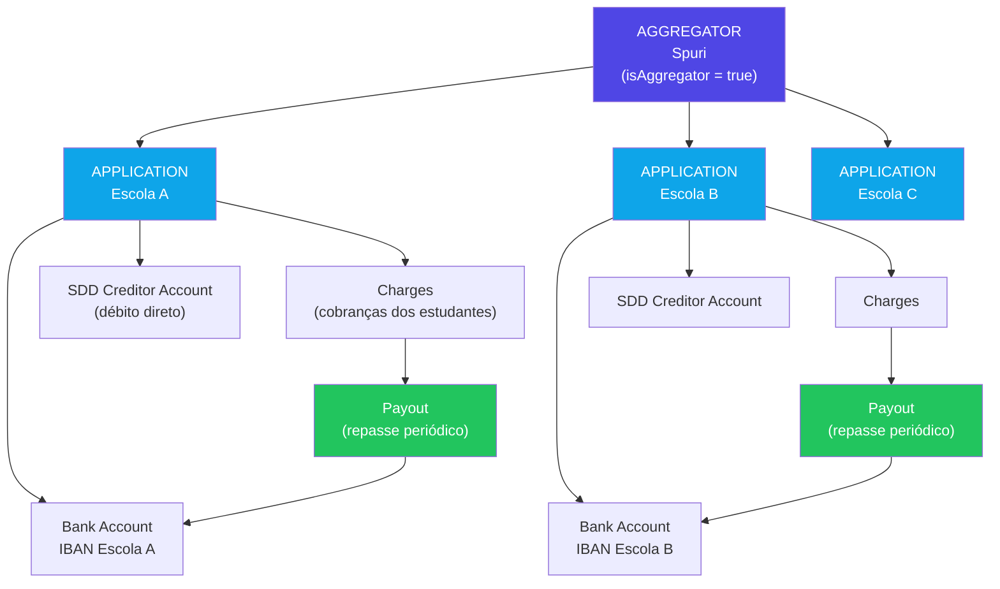
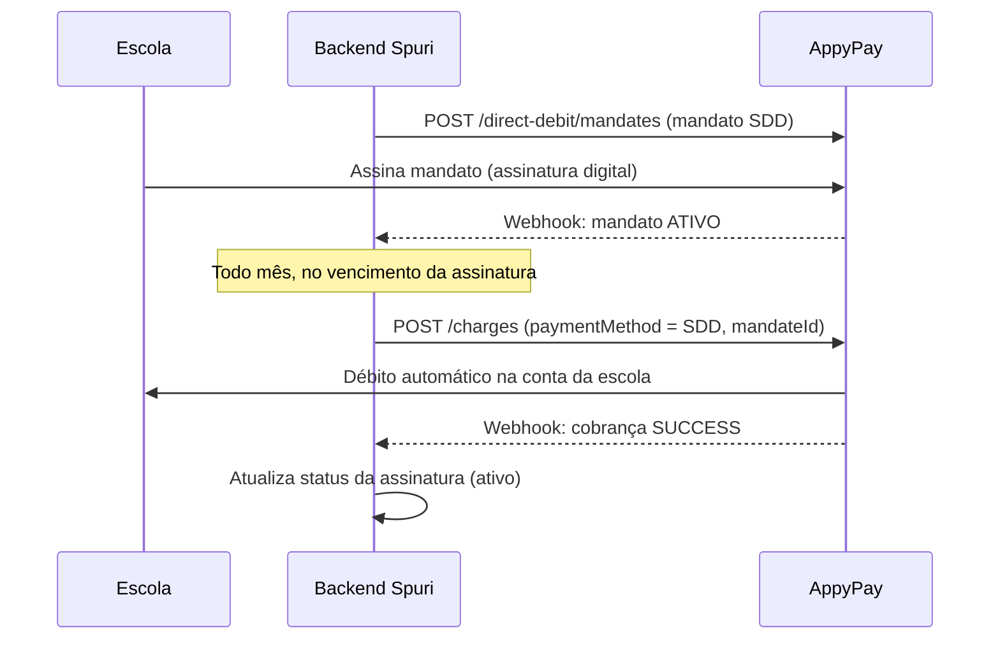
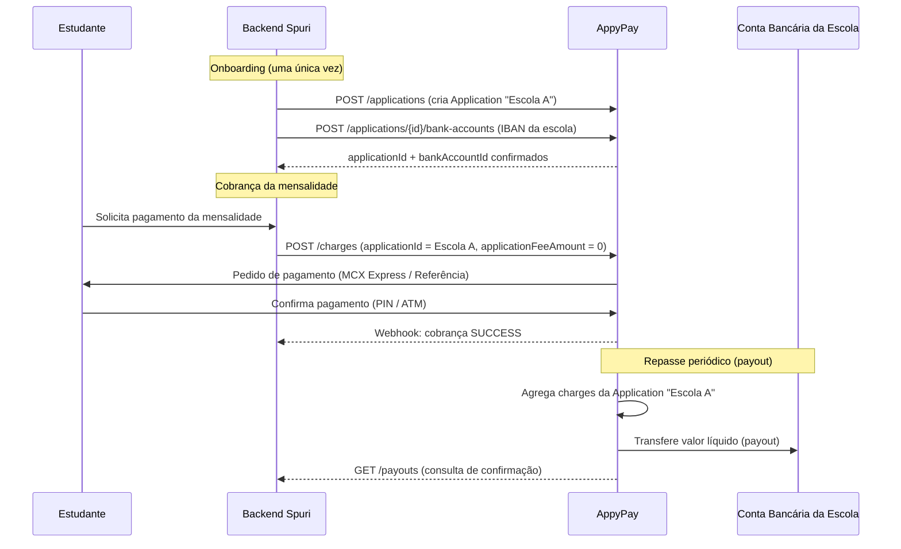

# Análise Técnica — Integração de Pagamentos AppyPay para o Spuri

**Data:** 21 de junho de 2026
**Autor:** Fredy Pendragon
**Objetivo:** avaliar se a AppyPay consegue suprir as necessidades de pagamento do Spuri, com base na documentação técnica oficial da API.

---

## 1. Contexto e necessidade

O Spuri tem dois fluxos de pagamento distintos e independentes:

1. **Spuri → recebe assinatura mensal das escolas** pelo uso da plataforma.
2. **Escolas → recebem mensalidades dos seus estudantes**, usando a plataforma do Spuri apenas como facilitador técnico, **sem que o Spuri retenha qualquer comissão ou toque no dinheiro**.

O desafio do Fluxo 2 é que, em Angola, nenhuma entidade pode intermediar fundos financeiros sem ser um PSP (banco) ou um PST-SP certificado pela EMIS — por isso era necessário confirmar se a AppyPay (que já tem essa certificação) oferece uma forma de o Spuri gerir os pagamentos de múltiplas escolas, cada uma recebendo diretamente na sua própria conta bancária.

---

## 2. Conceitos-chave da arquitetura AppyPay

Antes de explicar o fluxo, é importante entender o vocabulário usado pela própria API. Estes termos aparecem nos _schemas_ (estruturas de dados) da documentação oficial.

### Merchant (Comerciante)

É a entidade que tem uma conta na AppyPay e está autorizada a cobrar pagamentos. Tem um `merchantId` único. Normalmente, um comerciante = uma empresa.

### Aggregator (Agregador) — `isAggregator = true`

Um tipo especial de _merchant_ que pode gerir **múltiplos comerciantes/aplicações abaixo de si**. A própria documentação afirma textualmente: _"Only merchant aggregators (isAggregator = true) can have GPO PST configurations."_ Isto é, só agregadores podem configurar o acesso ao GPO (Multicaixa Express) em nome de terceiros.

**No contexto do Spuri:** o Spuri seria registado como **Aggregator** — é o papel que lhe permite gerir os pagamentos de cada escola sem ser ele próprio o destinatário do dinheiro.

### Application (Aplicação)

Representa um sub-comerciante dentro da estrutura do agregador. Cada _application_ tem o seu próprio `applicationId`, as suas próprias contas bancárias (`bank-accounts`) e os seus próprios métodos de pagamento configurados.

**No contexto do Spuri:** cada **escola** seria registada como uma _application_ própria, vinculada ao Spuri como agregador.

### Bank Account (Conta bancária da Application)

O IBAN para onde o dinheiro de uma _application_ específica deve ser transferido. Associado via `POST /applications/{applicationId}/bank-accounts`.

**No contexto do Spuri:** é o IBAN que a escola regista uma única vez na plataforma do Spuri.

### Charge (Cobrança)

Uma transação de pagamento individual — por exemplo, uma mensalidade de um estudante. Criada via `POST /charges`, especificando `amount`, `paymentMethod` (GPO, REF, UMM, SDD, etc.) e a _application_ a que pertence.

### Application Fee Amount (Taxa da aplicação)

Um campo presente em cada _charge_ e em cada _payout_, que representa a comissão retida pelo agregador (o Spuri) sobre aquela transação. **No caso do Spuri, este valor será sempre 0**, porque o modelo de negócio não prevê comissão sobre as mensalidades das escolas.

### Payout (Repasse)

O mecanismo pelo qual a AppyPay agrega várias _charges_ de uma mesma _application_ num único pagamento de saída, transferido para o IBAN registado dessa _application_. Tem `amount` (total bruto), `feeAmount` (comissão da AppyPay) e `numberOfTransactions` (quantas cobranças foram agregadas).

**No contexto do Spuri:** é assim que o dinheiro chega, finalmente, à conta da escola — periodicamente, e não cobrança a cobrança.

### SDD (Direct Debit / Débito Direto) e Mandate (Mandato)

Mecanismo de cobrança recorrente automática. O pagador (devedor) assina um **mandato** (contrato formal, com assinatura digital) autorizando débitos automáticos na sua conta. Depois disso, o credor pode cobrar periodicamente sem necessidade de nova autorização a cada cobrança.

**No contexto do Spuri:** ideal tanto para a assinatura mensal das escolas ao Spuri, como para mensalidades recorrentes dos estudantes às escolas.

### Bank Participant (Banco participante)

Lista de bancos angolanos reconhecidos pela AppyPay para efeitos de transferências e contas (cada um com `bicCode`, `interbankCode`, etc.).

### GPO PST Configuration

Configuração técnica que liga o agregador ao GPO (o sistema de Multicaixa Express da EMIS) em nome dos comerciantes que gere. Inclui credenciais OAuth (`clientID`, tokens) e o campo `numOfMerchants`, que indica quantos comerciantes estão cobertos por aquela configuração.

---

## 3. Diagrama de arquitetura — hierarquia de entidades

---

## 4. Fluxo 1 — Spuri cobra assinatura das escolas

Neste fluxo, o Spuri é o próprio comerciante final — o dinheiro fica na conta do Spuri.

---

## 5. Fluxo 2 — Escola recebe mensalidades dos estudantes via Spuri

Neste fluxo, o Spuri nunca fica com o dinheiro — apenas orquestra a cobrança e o repasse para a escola.

---

## 6. Mapeamento de endpoints por funcionalidade

|Funcionalidade|Endpoint|Quem usa|
|---|---|---|
|Autenticação|`POST /oauth2/token`|Spuri (como agregador)|
|Criar cobrança|`POST /charges`|Spuri (em nome próprio ou da escola)|
|Consultar cobrança|`GET /charges/{id}`|Spuri|
|Notificação de pagamento|Webhook (configurado pelo Spuri)|AppyPay → Spuri|
|Registar conta bancária da escola|`POST /applications/{applicationId}/bank-accounts`|Spuri (onboarding da escola)|
|Criar mandato de débito direto|`POST /direct-debit/mandates`|Spuri (assinatura ou mensalidade recorrente)|
|Consultar/cancelar mandato|`GET /mandates/{id}`, `POST /mandates/{id}/cancel`|Spuri|
|Consultar contas de credor SDD|`GET /applications/{applicationId}/sdd-creditor-accounts/{id}`|Spuri|
|Consultar repasses|`GET /payouts`, `GET /payouts/{transferId}`|Spuri (para reconciliação/auditoria)|
|Configuração de agregador (GPO)|`POST/GET/PATCH /merchants/{merchantId}/gpo-pst-configurations`|Spuri (configuração inicial)|
|Lista de bancos suportados|`GET /bank-participants`|Spuri (formulário de onboarding da escola)|
|Checkout pronto|Widget (`<script>` embutível)|Estudante (tela de pagamento)|

---

## 7. O que está confirmado vs. o que falta confirmar

### ✅ Confirmado pela documentação técnica

- Existe um papel de **agregador** (`isAggregator = true`) que gere múltiplos sub-comerciantes.
- Cada escola pode ser modelada como uma **application** própria, com IBAN e contas de débito direto associadas.
- O dinheiro de cada _application_ é repassado separadamente via **payout**, diretamente para o IBAN registado.
- A taxa de comissão por transação (`applicationFeeAmount`) é um campo configurável — compatível com o modelo "0% de comissão" do Spuri.
- Suporte nativo a **Débito Direto (SDD)** para cobranças recorrentes automáticas (ideal tanto para a assinatura do Spuri como para mensalidades das escolas).

### ❓ Pendente de confirmação comercial/contratual com a AppyPay

1. **Contrato e onboarding:** o Spuri assina um único contrato como agregador, ou cada escola precisa também de assinar algo com a AppyPay?
2. **Custo real do modelo de 0% de comissão:** confirmar se `applicationFeeAmount = 0` é viável sem custos ocultos (ex.: taxa fixa por _application_ criada).
3. **Frequência e custo dos payouts:** qual o intervalo dos repasses (diário, semanal?) e se há alguma taxa adicional sobre o `feeAmount` do payout, além da comissão de 0,4% já comunicada por transação.

---

## 8. Conclusão

A AppyPay **tem a funcionalidade técnica necessária** para suportar os dois fluxos de pagamento do Spuri — isto não é uma suposição, é confirmado pelos próprios schemas da API (`isAggregator`, `applications`, `bank-accounts`, `sdd-creditor-accounts`, `payouts`). Esta é uma vantagem significativa, porque permite ao Spuri operar este modelo **sem precisar de se tornar, ele próprio, um PST-SP certificado pela EMIS** — processo que seria mais longo e burocrático.

O próximo passo é validar diretamente com a equipa comercial/técnica da AppyPay os três pontos pendentes listados na secção 7, usando a terminologia exata da própria API para acelerar o entendimento.